# TrainTest 1

```{r}
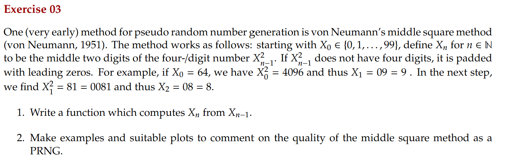
```

```{r}
middle_square <- function(x) {
  squared <- x^2
  squared_str <- sprintf("%04d", squared) # 4-digit string
  # Extract the middle two digits
  mid_digits <- substr(squared_str, 2, 3) # Extract the middle two digits
  return(as.numeric(mid_digits)) # back to num
}

# Generate a sequence of numbers
generate_sequence <- function(seed, n) {
  sequence <- numeric(n)
  sequence[1] <- seed
  for (i in 2:n) {
    sequence[i] <- middle_square(sequence[i-1])
  }
  return(sequence)
}

n <- 100  # N of iterations
sequence <- generate_sequence(22, n) # ofc if u change the seed u have complitely diff results

# Plot
plot(sequence, type='o', col='blue', xlab='Iteration', ylab='Generated Number',
     main='Middle Square Method Random Number Generation')

# Histogram
hist(sequence, breaks=10, col='lightblue', main='Histogram of Generated Numbers',
     xlab='Generated Number', ylab='Frequency')

# Autocorrelation analysis
acf(sequence, main='Autocorrelation of Middle Square Sequence')

```
```{r}
# The Middle Square Method tends to fall into short cycles or reach zero quickly, making it an unreliable PRNG
# The histogram may show non-uniform distribution, indicating poor randomness
# The autocorrelation plot can reveal dependencies between generated numbers
```

```{r}

```

```{r}
generate_random_numbers <- function(n) {
  u <- runif(n)  
  x <- 1 / (1 - u)  # inverse CDF transformation
  return(x)
}
random_numbers <- generate_random_numbers(10000)

# Plot histogram 
hist(random_numbers, breaks=50, probability=TRUE, col="lightblue", 
     main="Histogram of Generated Numbers", xlab="x")

# Overlay the theoretical density curve
curve(1/x^2, from=1, to=max(random_numbers), add=TRUE, col="red", lwd=2)

```

```{r}
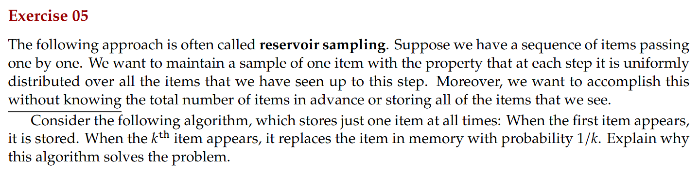
```

```{r}
# reservoir sampling (sampling one item from a stream)
reservoir_sampling <- function(stream) {
  reservoir <- NULL  # Initialize 
  
  for (k in seq_along(stream)) {
    if (k == 1) {
      reservoir <- stream[k]  # Store the first item
    } else {
      if (runif(1) < 1/k) {  # Replace with probability 1/k
        reservoir <- stream[k]
      }
    }
  }
  return(reservoir)  
}
# Simulating
stream <- 1:1000 
sampled_item <- reservoir_sampling(stream)

print(sampled_item) # each time ofc it returns a diff number
```

```{r}

```

```{r}
n <- 100000 # Simulation
mean_duration <- 30

# exponential durations 
X1 <- rexp(n, rate = 1/mean_duration)  # First student's appointment 
X2 <- rexp(n, rate = 1/mean_duration)  # Second student's appointment 

total_time <- X1 + 5 + X2 

expected_time <- mean(total_time)

# Print result
print(expected_time)
```

```{r}
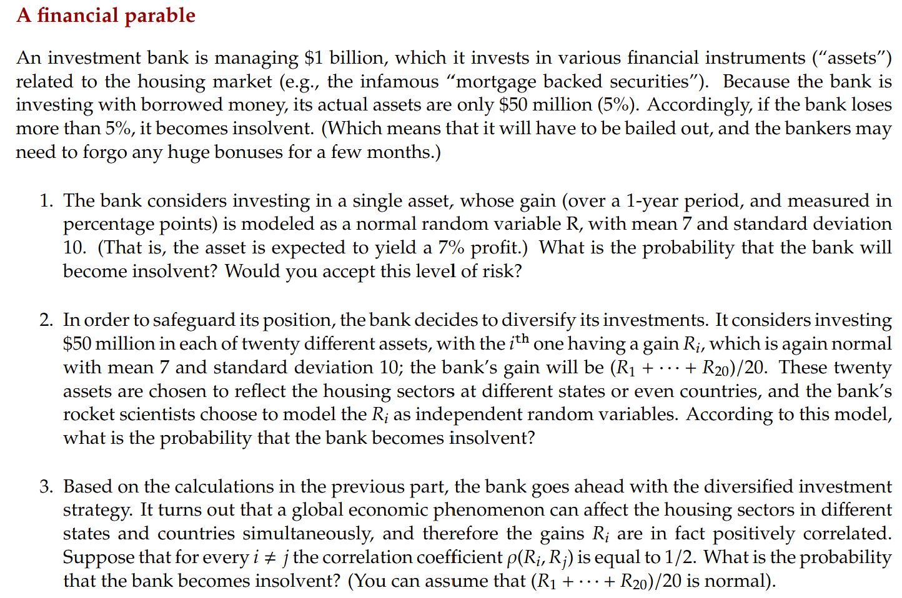
```

```{r}
n_sim <- 100000  # N simulations

# Part 1: Single Asset Investment
mean_r <- 7
sd_r <- 10
threshold <- -5 # if the bank lose more than this it becomes insolvent

# Simulating single asset returns
single_asset_returns <- rnorm(n_sim, mean = mean_r, sd = sd_r)
prob_insolvency_single <- mean(single_asset_returns < threshold)
print(paste("Probability of insolvency (single asset):", prob_insolvency_single))

# Part 2: Diversified Independent Investment
n_assets <- 20
sd_avg_independent <- sd_r / sqrt(n_assets)

# Simulating diversified independent returns
diversified_returns <- rnorm(n_sim, mean = mean_r, sd = sd_avg_independent)
prob_insolvency_diversified <- mean(diversified_returns < threshold)
print(paste("Probability of insolvency (independent diversification):", prob_insolvency_diversified))

# Part 3: Diversified Correlated Investment
rho <- 0.5 # correlation coefficient
var_avg_correlated <- (sd_r^2 / n_assets) + ((n_assets - 1) * rho * sd_r^2 / n_assets^2)
sd_avg_correlated <- sqrt(var_avg_correlated)

# Simulating diversified correlated returns
diversified_corr_returns <- rnorm(n_sim, mean = mean_r, sd = sd_avg_correlated)
prob_insolvency_diversified_corr <- mean(diversified_corr_returns < threshold)
print(paste("Probability of insolvency (correlated diversification):", prob_insolvency_diversified_corr))
```
```{r}
# A single asset has high variance so it's expected to behave like this
# independent diversification reduced the risk to 0
# correlated diversification should not be exactly 0 but a little bit higher, anyway still really close to the independent case
```

```{r}
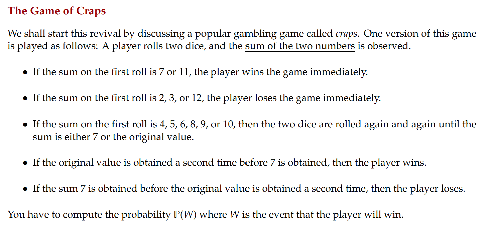
```

```{r}
# winning in the game of Craps
n_sim <- 100000  # Number of simulations

# simulate one game of Craps
simulate_craps <- function() {
  roll_dice <- function() sample(1:6, 2, replace = TRUE)  # Roll two dice
  first_roll <- sum(roll_dice())
  
  # Immediate win conditions
  if (first_roll == 7 || first_roll == 11) {
    return(1)  # Win
  }
  
  # Immediate loss conditions
  if (first_roll == 2 || first_roll == 3 || first_roll == 12) {
    return(0)  # Loss
  }
  
  # Continue rolling for "point" cases
  point <- first_roll
  repeat {
    new_roll <- sum(roll_dice())
    if (new_roll == point) {
      return(1)  # Win
    }
    if (new_roll == 7) {
      return(0)  # Loss
    }
  }
}

# Run 
wins <- sum(replicate(n_sim, simulate_craps()))
prob_win <- wins / n_sim

print(paste("Estimated Probability of Winning:", round(prob_win, 4)))
```

```{r}

```

```{r}
p_sid = 0.8
p_sic = 0.6
P_both_class = p_sid * p_sic
P_at_least_one = p_sid + p_sic - P_both_class
print(paste("At least one in class:",P_at_least_one))
# P(sid|P_at_least_one) conditional prob
P_sid_given_at_least_one = p_sid/P_at_least_one
print(paste("If at least one in class, that one is Sid:",P_sid_given_at_least_one))
     
```
```{r}

```

```{r}
p = 0.01
n = 10
exact_one = dbinom(1, n, p)
print(paste("exact_one:",exact_one))
at_least_one = 1 - dbinom(0, n, p)
print(paste("at_least_one:",at_least_one))
threshold = 0.8
init = 1
while ((1 - dbinom(0, size = init, prob = p)) < threshold) {
  init <- init + 1
  }
print(paste("Min missiles required:" ,init))

```
```{r}
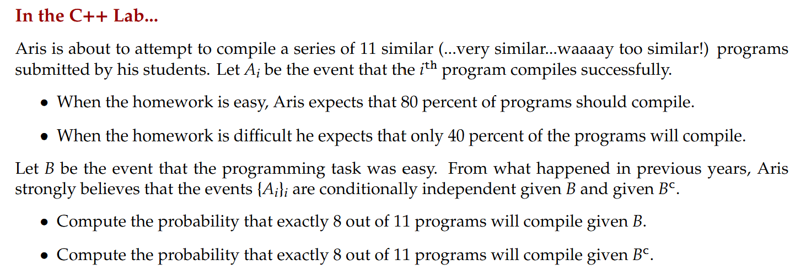
```

```{r}
n = 11
x=8
p_easy = 0.8
p_hard = 0.4
p_when_easy = dbinom(x,n,p_easy)
p_when_hard = dbinom(x,n,p_hard)
print(paste("p_when_easy:" ,p_when_easy))
print(paste("p_when_hard:" ,p_when_hard))
```
```{r}
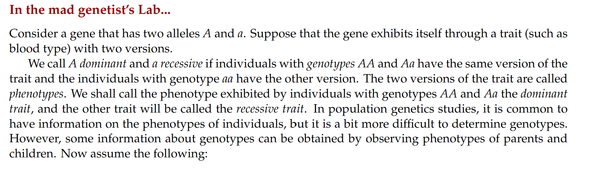
```

```{r}
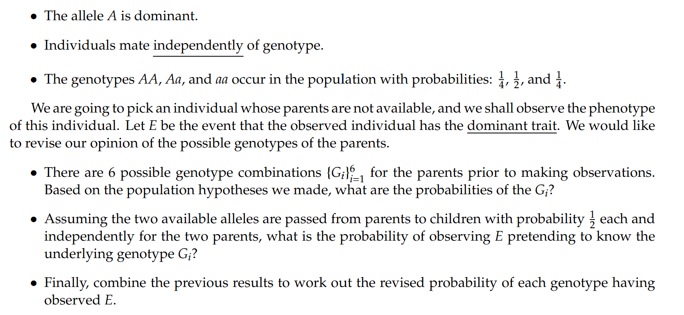
```

```{r}
AA = 1/4
Aa = 1/2
aa = 1/4
# prior probabilities of parent genotypes
parent_genotypes <- c("AA-AA", "AA-Aa", "AA-aa", "Aa-Aa", "Aa-aa", "aa-aa")
prior_probs <- c(1/16, 1/8, 1/16, 1/4, 1/8, 1/16) # those results were obtained by multiplying individual probabilities since indipendent
# probability of observing dominant trait E given each genotype
p_E_given_G <- c(1, 1, 0.5, 0.75, 0.5, 0) # obtained by idk how some medical knowledge
# prob of observing E (invidual has the dominant trait) using Law of total prob
P_E <- sum(p_E_given_G * prior_probs)
posterior_probs <- (p_E_given_G * prior_probs) / P_E # Bayes theorem
# in df for cleaness
results <- data.frame(
  Genotype = parent_genotypes,
  Prior_Probability = prior_probs,
  P_E_given_G = p_E_given_G,
  Posterior_Probability = posterior_probs
)
results
```

```{r}

```

```{r}
p_r = 0.1
p_b = 0.2
p = 0.5
# Case no payout
p_rC = 1 - p_r
p_bC = 1 - p_b
p_noPayout = p_rC * p + p_bC * p # Law of total prob
# Bayes Theorem
p_r_noPayout = p_rC * p /p_noPayout
p_b_noPayout = p_bC * p /p_noPayout
print(paste("p_r_noPayout:" ,p_r_noPayout))
print(paste("p_b_noPayout:" ,p_b_noPayout))
# Case payout
p_Payout = p_r * p + p_b * p # Law of total prob
p_r_Payout = p_r * p /p_Payout
p_b_Payout = p_b * p /p_Payout
print(paste("p_r_Payout:" ,p_r_Payout))
print(paste("p_b_Payout:" ,p_b_Payout))
```
```{r}
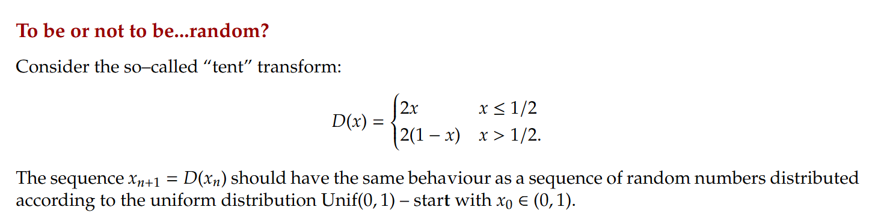
```
```{r}
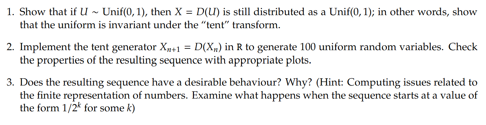
```

```{r}
tent_map = function(x) {
  if (x<= 1/2) {
    return(2*x)
  }
  if (x>1/2) {
    return(2*(1-x))
  }
}

n = 100  
x <- numeric(n)
x[1] <- runif(1)  # Initial value from U(0,1)

for (i in 2:n) {
  x[i] <- tent_map(x[i-1])
}

# Plot the sequence
plot(1:n, x, type="o", col="blue", pch=20, xlab="Iteration", ylab="X_n",
     main="Tent Map Sequence")

# Histogram
hist(x, probability=TRUE, breaks=20, col="lightblue", 
     main="Histogram of Tent Map Values", xlab="X_n")
# Uniformity checked
```

```{r}
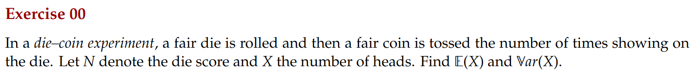
```

```{r}
p_die = 1/6
p_coin = 1/2
# E[X] = E[E[X|N]]
expected_die = (1+2+3+4+5+6) * p_die # using law of total prob
expected_coin = expected_die * p_coin
print(paste("expected_coin (E[X]):" ,expected_coin))
# var(X) = E[var(X|N)] + var(E[X|N])
var_coin = p_coin * (1 - p_coin)
E_var_coin = expected_die * var_coin
En_squared = (1^2 + 2^2 + 3^2 + 4^2 + 5^2 + 6^2) * p_die
var_N = En_squared - (expected_die)^2
var_E_X_n = var_N * var_coin
var_X = E_var_X_n + var_E_X_n
print(paste("variance_coin (var(X)):" ,var_X))

```

```{r}
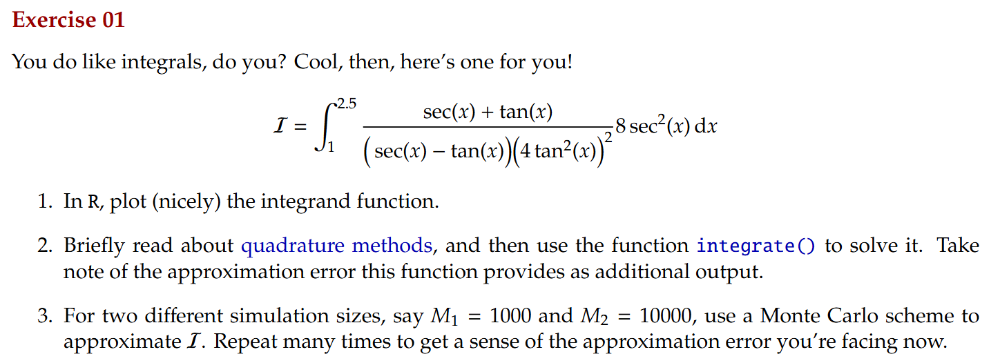
```

```{r}
lower = 1
upper = 2.5
sec <- function(x) {
  return(1 / cos(x))
} # since it's not build in in R

integrand = function(x) {
  num = sec(x) + tan(x)
  den = (sec(x)- tan(x))*(4* tan(x)^2)^2
  return((num/den)*8*sec(x)^2)
}
library(ggplot2)

x_vals <- seq(1, 2.5, length.out = 1000)
y_vals <- sapply(x_vals, integrand)

ggplot(data.frame(x=x_vals, y=y_vals), aes(x, y)) +
  geom_line(color='blue') +
  ggtitle("Integrand Function") +
  xlab("x") +
  ylab("f(x)") +
  theme_minimal()
```
```{r}
result <- integrate(integrand, lower, upper)
print(result)
```
```{r}
montecarlo = function(M){
  x_samples <- runif(M, min = lower, max = upper)
  f_samples <- integrand(x_samples)
  estimate <- (2.5 - 1) * mean(f_samples)
  return(estimate)
}
M1 <- 1000
M2 <- 10000

mc_estimate_1 <- montecarlo(M1)
mc_estimate_2 <- montecarlo(M2)

print(paste("Monte Carlo estimate with M1=", M1, ":", mc_estimate_1))
print(paste("Monte Carlo estimate with M2=", M2, ":", mc_estimate_2))
# Ofc bigger simulation size leads to more reliable results+
```
```{r}
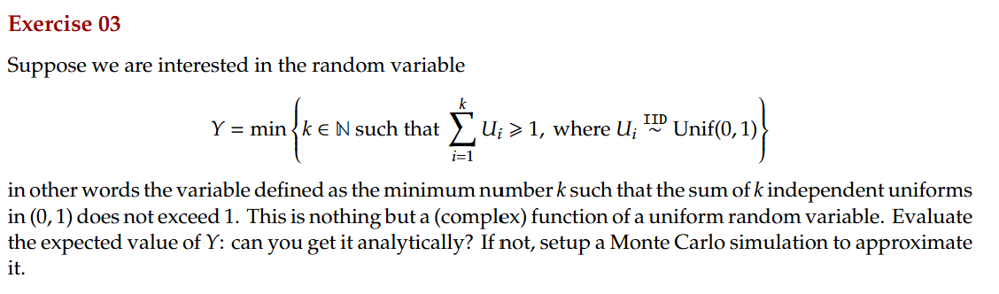
```

```{r}
compute_Y <- function() {
  sum_U <- 0
  k <- 0
  while (sum_U < 1) {
    sum_U <- sum_U + runif(1)
    k <- k + 1
  }
  return(k)
}
n_sim <- 100000

y_values <- replicate(n_sim, compute_Y())

expected_Y <- mean(y_values)
print(paste("Estimated E[Y] from Monte Carlo:", round(expected_Y, 4)))
# It converge to e
```
```{r}
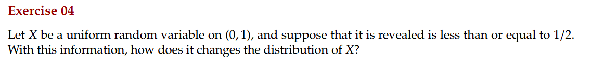
```

```{r}
n = 100000
x_vals = runif(n)
filtered_x_vals = x_vals[x_vals <= 0.5]
mean(filtered_x_vals)
var(filtered_x_vals)
```
```{r}
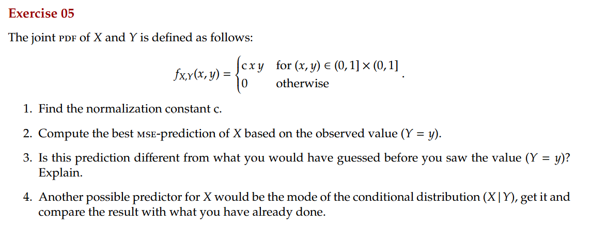
```
```{r}
n_sim <- 100000
# Generate (X, Y) samples from joint PDF f_{X,Y}(x,y) = 4xy
sample_X <- runif(n_sim)
sample_Y <- runif(n_sim)
keep <- runif(n_sim) < 4 * sample_X * sample_Y  # Accept-reject sampling
X <- sample_X[keep]
Y <- sample_Y[keep]

# empirical conditional expectation E[X | Y]
expected_X_given_Y <- mean(X)

# Compute empirical mode (most frequent value in bins)
hist_data <- hist(X, breaks=100, plot=FALSE) # increasing n of bins makes results more reliable
mode_X_given_Y <- hist_data$breaks[which.max(hist_data$counts)]

print(paste("Empirical E[X | Y]:", round(expected_X_given_Y, 4)))
print(paste("Empirical mode of X | Y:", round(mode_X_given_Y, 4)))

hist(X, probability=TRUE, breaks=50, col="lightblue",
     main="Empirical Distribution of X", xlab="X", ylab="Density")

# Theorical E[X|Y] = 2/3, I don't think raise the number of simulations will lead us to the theorical results, there may be something wrong I didn't consider.
```

```{r}
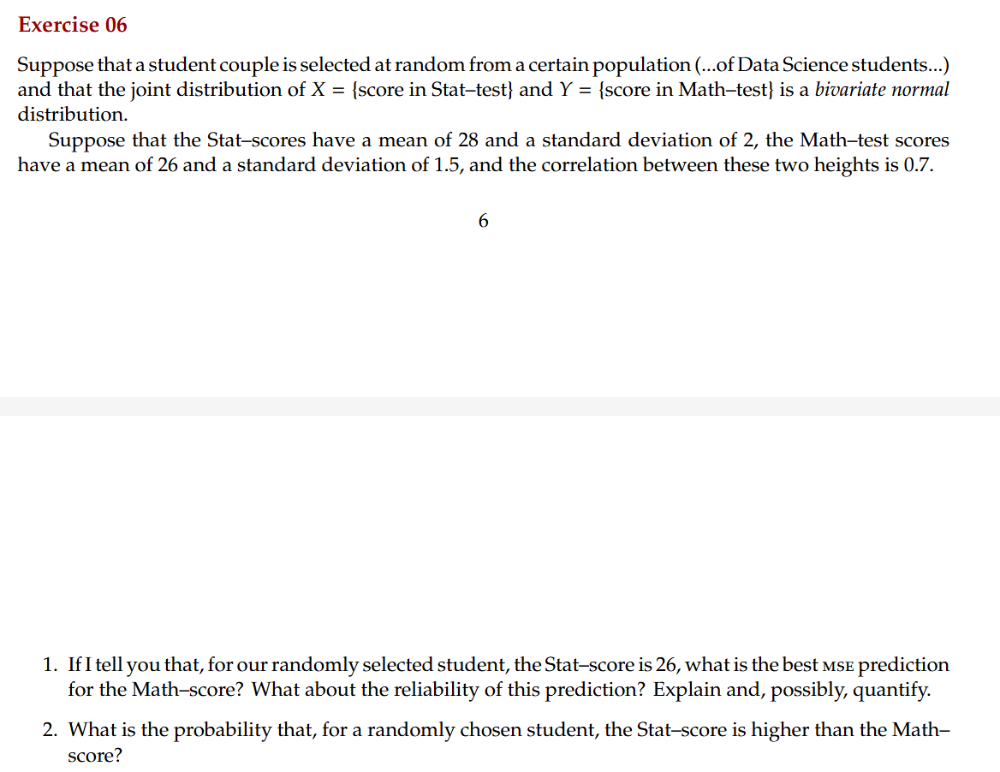
```

```{r}
mu_X <- 28
sigma_X <- 2
mu_Y <- 26
sigma_Y <- 1.5
rho <- 0.7

X_given <- 26
# Best MSE Prediction for Y given X
pred_Y_given_X <- mu_Y + rho * (sigma_Y / sigma_X) * (X_given - mu_X)

# conditional standard deviation of Y | X
sigma_Y_given_X <- sqrt((1 - rho^2) * sigma_Y^2)

print(paste("Best MSE Prediction for Y given X = 26:", round(pred_Y_given_X, 4)))
print(paste("Standard deviation of prediction:", round(sigma_Y_given_X, 4)))

n_sim <- 1000000
# bivariate normal samples, use of Montecarlo like method
library(MASS)
Sigma <- matrix(c(sigma_X^2, rho * sigma_X * sigma_Y, 
                  rho * sigma_X * sigma_Y, sigma_Y^2), nrow=2)
data <- mvrnorm(n_sim, mu=c(mu_X, mu_Y), Sigma=Sigma)

X_samples <- data[,1]
Y_samples <- data[,2]

# Compute probability P(X > Y)
prob_X_greater_Y <- mean(X_samples > Y_samples)

# Print probability result
print(paste("Estimated P(X > Y):", round(prob_X_greater_Y, 4))) 

# Easier way to do it:
# Compute probability P(X > Y) using normal tables
mu_D <- mu_X - mu_Y  # Mean of D = X - Y
sigma_D <- sqrt(sigma_X^2 + sigma_Y^2 - 2 * rho * sigma_X * sigma_Y)  # Std dev of D

# Compute P(X > Y) = P(D > 0) = 1 - P(D <= 0)
z_value <- (0 - mu_D) / sigma_D
prob_X_greater_Y <- 1 - pnorm(z_value)

# Print probability result
print(paste("Estimated P(X > Y) using normal tables:", round(prob_X_greater_Y, 4)))

```
```{r}
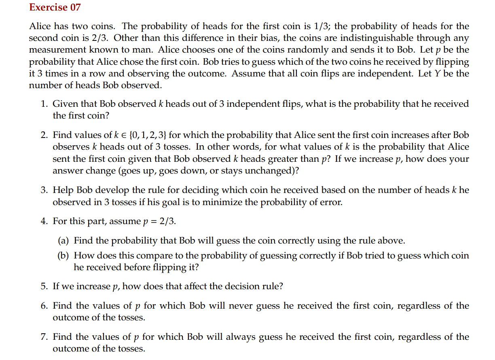
```
```{r}
# Function to compute posterior probability P(C1 | Y = k)
posterior_C1 <- function(k, p) {
  p_H_C1 <- 1/3  
  p_H_C2 <- 2/3  

  # likelihood P(Y = k | C1) and P(Y = k | C2)
  P_Y_given_C1 <- choose(3, k) * (p_H_C1^k) * ((1 - p_H_C1)^(3 - k))
  P_Y_given_C2 <- choose(3, k) * (p_H_C2^k) * ((1 - p_H_C2)^(3 - k))

  # total probability P(Y = k)
  P_Y <- P_Y_given_C1 * p + P_Y_given_C2 * (1 - p)

  # posterior probability
  P_C1_given_Y <- (P_Y_given_C1 * p) / P_Y
  return(P_C1_given_Y)
}

# Function to compute Bob's probability of guessing correctly
compute_accuracy <- function(p) {
  correct_prob <- 0

  # Iterate over all possible k values
  for (k in 0:3) {
    P_C1_given_Y <- posterior_C1(k, p)
    
    # Decision Rule: Guess C1 if P(C1 | Y = k) > 0.5, else guess C2
    if (P_C1_given_Y > 0.5) {
      correct_prob <- correct_prob + P_C1_given_Y * choose(3, k) * (p * (1/3)^k * (2/3)^(3-k) + (1 - p) * (2/3)^k * (1/3)^(3-k))
    } else {
      correct_prob <- correct_prob + (1 - P_C1_given_Y) * choose(3, k) * (p * (1/3)^k * (2/3)^(3-k) + (1 - p) * (2/3)^k * (1/3)^(3-k))
    }
  }
  
  return(correct_prob)
}

p <- 2/3
for (k in 0:3) {
  cat("P(C1 | Y =", k, ") =", round(posterior_C1(k, p), 4), "\n")
}

# Compute Bob's probability of guessing correctly
accuracy <- compute_accuracy(p)
cat("\nBob's probability of guessing correctly (with decision rule) =", round(accuracy, 4), "\n")

# Compare with random guessing accuracy
random_guess_accuracy <- max(p, 1 - p)
cat("Bob's accuracy if he just guessed randomly =", round(random_guess_accuracy, 4), "\n")
```


