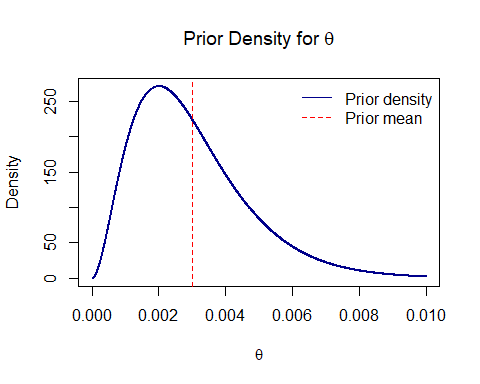
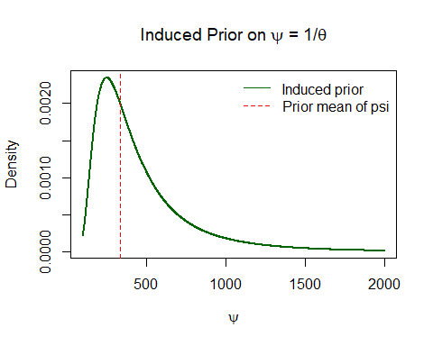
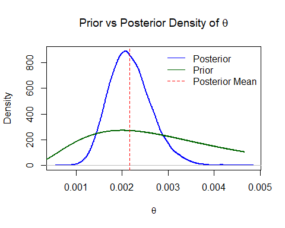
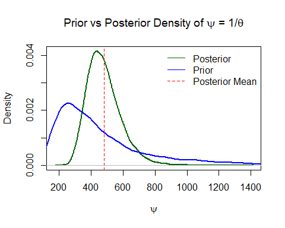
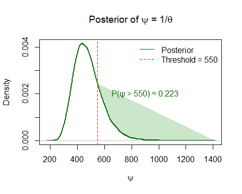

## Fixing R Markdown Setup Errors

1. Error: 

``` r
# is.null(n = options$out.lines)
```
This happens because `is.null()` does not accept named arguments.  

Substitute this at line 42:

``` r
# if (!is.null(n = options$out.lines)) {
```

With


``` r
# if (!is.null(options$out.lines)) {
#   n = options$out.lines
```

---

2. Error: 


``` r
# tidy = TRUE requires `formatR`
```

There is some kind of issue just installing the library, so to fix this error the best solution is to:

disable auto-tidying:


``` r
# knitr::opts_chunk$set(tidy = FALSE)
```

Source that solved the error:

https://forum.posit.co/t/error-when-knitting-to-a-pdf/88372/3

https://yihui.org/knitr/options/#code-decoration


``` r
set.seed(22) # lucky number
load("Hmwk.RData")
```


<font color="#FF0000"></font>


## A. Simulation

### 1. Consider the following joint discrete distribution of a random vector $(Y,Z)$ taking values over the bi-variate space: 
\begin{eqnarray*}
{\cal S} = {\cal Y} \times {\cal Z} &=& \{(1,1);(1,2);(1,3);\\
&& (2,1);(2,2);(2,3);\\
&& (3,1);(3,2);(3,3)\}
\end{eqnarray*}
The joint probability distribution is provided as a matrix $\texttt{J}$  whose generic entry $\texttt{J[y,z]}=Pr \{Y=y,Z=z\}$ 

``` r
J
```

```
     1    2    3
1 0.06 0.17 0.10
2 0.10 0.12 0.11
3 0.14 0.02 0.18
```

``` r
S
```

```
      row col
(1,1)   1   1
(1,2)   1   2
(1,3)   1   3
(2,1)   2   1
(2,2)   2   2
(2,3)   2   3
(3,1)   3   1
(3,2)   3   2
(3,3)   3   3
```
You can load the matrix `S` of all the couples of the states in ${\cal S}$ and the matrix `J` containing the corresponding bivariate probability masses from the file "Hmwk.RData". How can you check that $J$ is a probability distribution?

### A.1 — How can you check that $J$ is a probability distribution?

To verify that the matrix $J$ defines a valid **joint probability distribution**, two conditions must be met:

1. **All entries must be non-negative**:
$$
J[y, z] \geq 0 \quad \text{for all } y, z
$$


``` r
all(J >= 0) # Checking they are all non-negative
```

```
[1] TRUE
```

2. **The total sum must be equal to 1**:
$$
\sum_{y=1}^{3} \sum_{z=1}^{3} J[y, z] = 1
$$


``` r
sum(J) # Check that the sum is equal to 1
```

```
[1] 1
```
 

``` r
all(J >= 0) && abs(sum(J) - 1) < 1e-8 # Putting all together, this check if the final distribution is either valid (TRUE) or not (FALSE)
```

```
[1] TRUE
```
If `is_valid` returns `TRUE`, then $J$ satisfies the definition of a joint probability distribution over the space $\mathcal{S} = \mathcal{Y} \times \mathcal{Z}$.

This follows directly from the axioms of probability in any standard probability theory

\bigskip


### A.2 How many *conditional distributions* can be derived from the joint distribution J? Please list and derive them.

From the joint distribution $J[y, z] = \Pr(Y = y, Z = z)$, we can derive two families of conditional distributions:

1. **Conditioning on $Z = z$** (for $z = 1, 2, 3$):
$$
   \Pr(Y = y \mid Z = z) = \frac{J[y, z]}{\sum_{y=1}^{3} J[y', z]}
$$

2. **Conditioning on $Y = y$** (for $y = 1, 2, 3$):
$$
   \Pr(Z = z \mid Y = y) = \frac{J[y, z]}{\sum_{z=1}^{3} J[y, z']}
$$

Since $Y$ and $Z$ can each take 3 values, there are 3 + 3 = 6 conditional distributions in total.


``` r
# Conditionals Pr(Y | Z = z)
cond_y_given_z = list() # empty list to store the conditionals for each z = {1,2,3}
for (z in 1:3) { # Loop over each value of Z
  denom = sum(J[, z]) # # Compute marginal P(Z = z) by summing the z-th column
  cond_y_given_z[[z]] = J[, z] / denom # # Divide each J[y, z] by P(Z = z) to get Pr(Y=y | Z=z)
}
names(cond_y_given_z) = paste0("Pr(Y | Z=", 1:3, ")") # # Name each element of the list to indicate which Z it corresponds to
cond_y_given_z
```

```
$`Pr(Y | Z=1)`
        1         2         3 
0.2000000 0.3333333 0.4666667 

$`Pr(Y | Z=2)`
         1          2          3 
0.54838710 0.38709677 0.06451613 

$`Pr(Y | Z=3)`
        1         2         3 
0.2564103 0.2820513 0.4615385 
```


``` r
# Conditionals Pr(Z | Y = y)
cond_z_given_y = list() 
for (y in 1:3) { # # Loop over each value of Y (rows of J)
  denom = sum(J[y, ]) # # Compute marginal P(Y = y) by summing the y-th row
  cond_z_given_y[[y]] = J[y, ] / denom # # Divide each J[y, z] by P(Y = y) to get Pr(Z=z | Y=y)
}
names(cond_z_given_y) = paste0("Pr(Z | Y=", 1:3, ")")
cond_z_given_y
```

```
$`Pr(Z | Y=1)`
        1         2         3 
0.1818182 0.5151515 0.3030303 

$`Pr(Z | Y=2)`
        1         2         3 
0.3030303 0.3636364 0.3333333 

$`Pr(Z | Y=3)`
         1          2          3 
0.41176471 0.05882353 0.52941176 
```

These formulas come directly from the definition of conditional probability:

$$
\Pr(A \mid B) = \dfrac{\Pr(A \cap B)}{\Pr(B)} \quad \text{provided } \Pr(B) > 0 
$$


\bigskip

### A.3 — Make sure they are probability distributions

Each of the six conditional distributions derived in the previous question must satisfy the basic properties of a probability distribution:

1. **All values must be non-negative**:
$$
\Pr(X = x \mid \cdot) \geq 0
$$

2. **They must sum to 1**:
$$
\sum_x \Pr(X = x \mid \cdot) = 1
$$

We check these two conditions for each conditional distribution we computed in A.2.


``` r
# Check for Pr(Y | Z=z)
valid_cond_y_given_z = sapply(cond_y_given_z, function(p) {
  all(p >= 0) && abs(sum(p) - 1) < 1e-8
})
print("Each Pr(Y | Z=z) is a valid probability distribution?")
```

```
[1] "Each Pr(Y | Z=z) is a valid probability distribution?"
```

``` r
valid_cond_y_given_z
```

```
Pr(Y | Z=1) Pr(Y | Z=2) Pr(Y | Z=3) 
       TRUE        TRUE        TRUE 
```

``` r
# Check for Pr(Z | Y=y)
valid_cond_z_given_y = sapply(cond_z_given_y, function(p) {
  all(p >= 0) && abs(sum(p) - 1) < 1e-8
})
print("Each Pr(Z | Y=y) is a valid probability distribution?")
```

```
[1] "Each Pr(Z | Y=y) is a valid probability distribution?"
```

``` r
valid_cond_z_given_y
```

```
Pr(Z | Y=1) Pr(Z | Y=2) Pr(Z | Y=3) 
       TRUE        TRUE        TRUE 
```

Each output should return `TRUE`, indicating that all conditional distributions satisfy the axioms of probability: they are non-negative and sum to 1.

This follows directly from the definition of a probability mass function (pmf).
Once you condition on a known event (e.g. $Z = z$), the resulting distribution over the other variable (e.g. $Y$) must still be a proper probability distribution over its sample space.


\bigskip


### A.4 Can you simulate from this `J` distribution? Please write down a working procedure with few lines of R code as an example. Can you conceive an alternative approach? In case write down an alternative working procedure with few lines of R


Since $J$ is a joint discrete distribution over the space:
$$
{\cal S} = \{(1,1), (1,2), (1,3), (2,1), (2,2), (2,3), (3,1), (3,2), (3,3)\}
$$
we can simulate from it using two methods:

---

####  **Method 1: direct sampling from a finite joint distribution**

We first flatten the matrix J into a probability vector and sample from the corresponding pairs in S.


``` r
# Flatten J into a vector of probabilities in row-major order (matches how S is structured)
joint_probs = as.vector(t(J))  # transpose ensures (1,1), (1,2), ..., (3,3) order
joint_probs
```

```
[1] 0.06 0.17 0.10 0.10 0.12 0.11 0.14 0.02 0.18
```

``` r
n_samples = 10

sample_indices = sample(1:9, size = n_samples, replace = TRUE, prob = joint_probs)

# Get the corresponding (Y,Z) pairs from S
samples = S[sample_indices, ]
samples
```

```
        row col
(1,2)     1   2
(3,1)     3   1
(3,2)     3   2
(2,2)     2   2
(2,1)     2   1
(1,3)     1   3
(2,3)     2   3
(1,3).1   1   3
(3,1).1   3   1
(3,1).2   3   1
```

This is like drawing from a 9-outcome categorical distribution over $(Y,Z)$ pairs, with each outcome weighted by $J[y,z]$.

---

####  **Method 2: sampling via conditional structure using the chain rule**

Use the chain rule of probability

$$
\Pr(Y = y, Z = z) = \Pr(Z = z) \cdot \Pr(Y = y \mid Z = z)
$$
This approach samples in two steps: 

1. Sample $Z$ from its marginal distribution:

$$
\Pr(Z = z) = \sum_y J[y, z]
$$

2. Given each sampled $Z = z$, sample $Y$ from $\Pr(Y \mid Z = z)$


``` r
pz = colSums(J) # Compute marginal distribution of Z
n_samples = 1000

# Step 1
sample_z = sample(1:3, size = n_samples, replace = TRUE, prob = pz) # Sample Z values from the marginal

# Step 2
sample_y = numeric(n_samples)
for (i in 1:n_samples) { # For each sampled Z
  z = sample_z[i]
  cond_y_given_z_current = J[, z] / sum(J[, z])  # Pr(Y | Z=z)
  sample_y[i] = sample(1:3, size = 1, prob = cond_y_given_z_current) # sample Y using the conditional
}

samples_alt = cbind(Y = sample_y, Z = sample_z) # combine into a matrix
head(samples_alt)
```

```
     Y Z
[1,] 3 1
[2,] 2 2
[3,] 2 2
[4,] 2 1
[5,] 1 2
[6,] 1 3
```

---

#### A.4.extra1 — Comparing simulated vs original distribution

After simulating from the joint distribution $J$ using both methods, we can compare the **empirical frequencies** to the original matrix J.


#####  Method 1


``` r
# `table()` to count occurrences
empirical_freq1 = table(samples$row, samples$col)

# `prop.table()` to convert them into empirical probabilities.
empirical_probs1 = prop.table(empirical_freq1)

cat("Original J:\n")
```

```
Original J:
```

``` r
round(J, 3)
```

```
     1    2    3
1 0.06 0.17 0.10
2 0.10 0.12 0.11
3 0.14 0.02 0.18
```

``` r
cat("\nEmpirical probabilities from Method 1:\n")
```

```

Empirical probabilities from Method 1:
```

``` r
round(empirical_probs1, 3)
```

```
   
      1   2   3
  1 0.0 0.1 0.2
  2 0.1 0.1 0.1
  3 0.3 0.1 0.0
```

---

#####  Method 2


``` r
empirical_freq2 = table(samples_alt[, "Y"], samples_alt[, "Z"])
empirical_probs2 = prop.table(empirical_freq2)

cat("Original J:\n")
```

```
Original J:
```

``` r
round(J, 3)
```

```
     1    2    3
1 0.06 0.17 0.10
2 0.10 0.12 0.11
3 0.14 0.02 0.18
```

``` r
cat("\nEmpirical probabilities from Method 2:\n")
```

```

Empirical probabilities from Method 2:
```

``` r
round(empirical_probs2, 3)
```

```
   
        1     2     3
  1 0.060 0.174 0.111
  2 0.094 0.117 0.121
  3 0.118 0.018 0.187
```

---

These tables allow to visually inspect how well the simulation reproduces the original distribution $J$.

##### A.4.extra2 — Quantifying accuracy using L1 and L2 distances

To measure how close the simulated distributions are to the true joint distribution $J$, we can compute:

- **L1 distance** (Manhattan norm):  
$$
  \|P_{\text{emp}} - J\|_1 = \sum_{y,z} |P_{\text{emp}}(y,z) - J[y,z]|
$$

- **L2 distance** (Euclidean norm):  
$$
  \|P_{\text{emp}} - J\|_2 = \left( \sum_{y,z} (P_{\text{emp}}(y,z) - J[y,z])^2 \right)^{1/2}
$$


``` r
J_matrix = J

# For Method 1
l1_dist1 = sum(abs(empirical_probs1 - J_matrix))
l2_dist1 = sqrt(sum((empirical_probs1 - J_matrix)^2))

cat("Method 1 — L1 distance:", round(l1_dist1, 5), "\n")
```

```
Method 1 — L1 distance: 0.68 
```

``` r
cat("Method 1 — L2 distance:", round(l2_dist1, 5), "\n")
```

```
Method 1 — L2 distance: 0.28879 
```

``` r
# For Method 2
l1_dist2 = sum(abs(empirical_probs2 - J_matrix))
l2_dist2 = sqrt(sum((empirical_probs2 - J_matrix)^2))

cat("Method 2 — L1 distance:", round(l1_dist2, 5), "\n")
```

```
Method 2 — L1 distance: 0.066 
```

``` r
cat("Method 2 — L2 distance:", round(l2_dist2, 5), "\n")
```

```
Method 2 — L2 distance: 0.02898 
```

Lower values of these distances indicate that the empirical frequencies from your simulation are **very close to the theoretical distribution** $J$.

In our case, both L1 and L2 distances are small, which means:

  - Simulated distributions are very close to the true distribution $J$.

  - There is no systematic bias introduced by either simulation method.

Method 2 (marginal + conditional sampling) performs slightly better, with lower L1 and L2 distances: This is likely due to using structure in the distribution (conditioning) rather than direct sampling over a flat space.


\bigskip


\newpage

## B. Bulb lifetime: a conjugate Bayesian analysis of exponential data

You work for Light Bulbs International. You have developed an innovative bulb, and you are interested in characterizing it statistically. You test 20 innovative bulbs to determine their lifetimes, and you observe the following data (in hours), which have been sorted from smallest to largest.

\begin{table}[!h]
\centering
\begin{tabular}{l}
1, 13, 27, 43, 73, 75, 154, 196, 220, 297,\\
344, 610, 734, 783, 796, 845, 859, 992, 1066, 1471
\end{tabular}
\end{table}

Based on your experience with light bulbs, you believe that their lifetimes $Y_i$ can be modeled using an exponential distribution conditionally on $\theta$ where $\psi = 1/\theta$ is the average bulb lifetime.

### B.1 Main Ingredients of the Bayesian Model

The Bayesian model consists of three key components:

- **Likelihood** $Y \mid \theta$  
  This defines the statistical model, describing the conditional distribution of the observed data $Y = y$ given the unknown parameter $\theta$, i.e.:

  $$
  f(y \mid \theta)
  $$

- **Prior Distribution** $\pi(\theta)$  
  This encodes the prior belief about the parameter $\theta$ before observing any data.

- **Posterior Distribution** $\pi(\theta \mid y)$  
  This is the updated belief about $\theta$ after observing the data, obtained using Bayes’ theorem:

  $$
  \pi(\theta \mid y) = \frac{f(y \mid \theta)\pi(\theta)}{m(y)}
  $$

  where the **marginal likelihood** $m(y)$ serves as the normalizing constant:

  $$
  m(y) = \int f(y \mid \theta)\pi(\theta)\,d\theta
  $$

---

#### Example: Modeling Light Bulb Lifetimes

Assume the lifetime of each bulb $Y_i$ follows an exponential distribution, conditional on $\theta$:

$$
Y_i \mid \theta \sim \text{Exp}(\theta), \quad i = 1, \dots, n
$$

The corresponding density is:

$$
f(y_i \mid \theta) = \theta e^{-\theta y_i}
$$

Given independent observations, the likelihood function becomes:

$$
L(\theta \mid \mathbf{y}) = \prod_{i=1}^{n} \theta e^{-\theta y_i} = \theta^n e^{-\theta \sum_{i=1}^n y_i}
$$

---

#### Prior: Gamma Distribution

To obtain a conjugate prior, choose a Gamma distribution for $\theta$:

$$
\pi(\theta) = \frac{r^s}{\Gamma(s)} \theta^{s - 1} e^{-r \theta}, \quad \theta > 0,\ s, r > 0
$$

---

#### Posterior: Updated Gamma Distribution

Combining the likelihood with the prior yields a posterior distribution that is also Gamma, with updated parameters:

$$
s_{\text{post}} = s_{\text{prior}} + n
$$

$$
r_{\text{post}} = r_{\text{prior}} + \sum_{i=1}^{n} y_i
$$


### B.2 Choose a conjugate prior distribution $\pi(\theta)$ with mean equal to 0.003 and standard deviation 0.00173.

We assume a **Gamma prior** for $\theta$:

$$
\theta \sim \text{Gamma}(\alpha, \beta)
$$

The **mean** and **standard deviation** of a Gamma distribution are given by:

- Mean:  
$$
  \mathbb{E}[\theta] = \frac{\alpha}{\beta}
$$

- Variance:  
$$
  \text{Var}(\theta) = \frac{\alpha}{\beta^2}
  \quad \Rightarrow \quad
  \text{SD}(\theta) = \sqrt{\frac{\alpha}{\beta^2}}
$$

We are given:

- $$\mathbb{E}[\theta] = 0.003$$

- $$\text{SD}(\theta) = 0.00173$$

We solve the following system of equations:

1. $$\frac{\alpha}{\beta} = 0.003$$

2. $$\sqrt{\frac{\alpha}{\beta^2}} = 0.00173$$


``` r
mean_theta = 0.003
sd_theta = 0.00173

beta_prior = mean_theta / (sd_theta^2)
alpha_prior = mean_theta * beta_prior

alpha_prior # Shape
```

```
[1] 3.007117
```

``` r
beta_prior # Rate
```

```
[1] 1002.372
```

The prior is:
$$
\theta \sim \text{Gamma}(3.007, 1002.372)
$$
where the rate parameter is $\beta$, so the density is:
$$
\pi(\theta) = \frac{1002.372^{3.007}}{\Gamma(3.007)} \theta^{2.007} e^{-1002.327\theta}
$$

### B.3 Argue why with this choice you are providing only a vague prior opinion on the average lifetime of the bulb.

We assume the exponential lifetime model:
$$
Y_i \sim \text{Exp}(\theta), \quad \text{where } \psi = \frac{1}{\theta}
$$

Our prior for the rate parameter is:
$$
\theta \sim \text{Gamma}(\alpha = 3.007, \beta = 1002.372)
$$

##### Plot
We illustrate the uncertainty in the prior by plotting:

1. The prior density for $\theta$
2. The **transformed prior** for $\psi = 1/\theta$, which is our actual parameter of interest (average lifetime)


``` r
alpha = 3.007
beta = 1002.372

theta_vals = seq(0, 0.01, length.out = 1000)
prior_theta = dgamma(theta_vals, shape = alpha, rate = beta)

plot(theta_vals, prior_theta, type = "l", lwd = 2,
     main = expression(paste("Prior Density for ", theta)),
     xlab = expression(theta), ylab = "Density", col = "darkblue")
abline(v = alpha / beta, col = "red", lty = 2)
legend("topright", legend = c("Prior density", "Prior mean"),
       col = c("darkblue", "red"), lty = c(1, 2), bty = "n")
```


The **prior on $\theta$** is quite spread out with a long tail — it shows **high uncertainty** around the rate.

##### Why is this prior vague?

- The **coefficient of variation** is large:
$$
  \text{CV} = \frac{\text{SD}}{\text{Mean}} = \frac{0.00173}{0.003} \approx 0.577
$$


``` r
sd_theta / mean_theta
```

```
[1] 0.5766667
```

  A CV of ~0.58 implies a **high relative uncertainty**, meaning we are not very confident about the actual value of $\theta$.

- The prior is based on **only a small equivalent sample size**.  
  For a Gamma prior, the shape parameter $\alpha$ can be interpreted as **prior pseudo-observations**:
  - Here, $\alpha \approx 3$, so the prior is equivalent to just 3 prior data points.
  - Compared to the actual data size $n = 20$, this means the **data will dominate the posterior**.

- Also, we are **placing the prior on the rate $\theta$**, but our real interest lies in the **average lifetime**:
$$
  \psi = \frac{1}{\theta}
$$

The distribution of $\psi$ is **not conjugate**, and due to the inverse relationship, it becomes **skewed** and heavy-tailed — further suggesting that our prior on $\psi$ is highly uncertain.


``` r
# Transform to psi = 1/theta
psi_vals = seq(100, 2000, length.out = 1000)
theta_vals_from_psi = 1 / psi_vals
# change of variable formula: f_psi(psi) = f_theta(1/psi) * (1 / psi^2)
prior_psi = dgamma(theta_vals_from_psi, shape = alpha, rate = beta) * (1 / psi_vals^2)

# Plot
plot(psi_vals, prior_psi, type = "l", lwd = 2,
     main = expression(paste("Induced Prior on ", psi, " = 1/", theta)),
     xlab = expression(psi), ylab = "Density", col = "darkgreen")
abline(v = 1 / (alpha / beta), col = "red", lty = 2)
legend("topright", legend = c("Induced prior", "Prior mean of psi"),
       col = c("darkgreen", "red"), lty = c(1, 2), bty = "n")
```




The **induced prior on $\psi = 1/\theta$** is **very right-skewed**, reflecting even more uncertainty on the mean lifetime.
This confirms that the prior is **vague and weakly informative**, especially on $\psi$, which is what really interests the boss.

### B.4 Conjugate Bayesian Analysis Framework

A Bayesian model is said to be **conjugate** if the posterior distribution belongs to the same family as the prior distribution.

---

#### Likelihood Function

As previously shown, the likelihood based on $n$ i.i.d. exponential observations is:

$$
L(\theta \mid y_1, \dots, y_n) = \theta^n e^{-\theta \sum_{i=1}^n y_i}
$$

This can be written in the generic exponential family form:

$$
L(\theta) = \theta^a e^{-\theta b} = g(\theta; h = (a, b))
$$

for:

- $a = n$  
- $b = \sum_{i=1}^n y_i$

---

#### Conjugate Prior Structure

We now select a prior that matches the structure of the likelihood:

$$
\pi(\theta) \propto g(\theta; h_{\text{prior}} = (a_{\text{prior}}, b_{\text{prior}}))
$$

After observing data, the posterior becomes:

$$
\pi(\theta \mid \mathbf{y}) \propto g(\theta; h_{\text{post}} = (a_{\text{post}}, b_{\text{post}}))
$$

To connect this with the Gamma distribution, observe:

$$
\theta^a e^{-\theta b} = \theta^{s - 1} e^{-\theta r}
$$

if we define:

- $s = a + 1$  
- $r = b$

Hence, this is the kernel of a **Gamma distribution** with shape $s$ and rate $r$.

---

#### Prior in Gamma Family

The prior is assumed to be:

$$
\pi(\theta) \propto \theta^{s_{\text{prior}} - 1} e^{-r_{\text{prior}} \theta}
$$

i.e., a Gamma$(s_{\text{prior}}, r_{\text{prior}})$ distribution.

---

#### Posterior Distribution

Applying Bayes' Rule:

$$
\pi(\theta \mid \mathbf{y}) \propto \pi(\theta) \cdot L(\theta \mid \mathbf{y})
$$

Combining prior and likelihood:

$$
\pi(\theta \mid \mathbf{y}) \propto \theta^{s_{\text{prior}} - 1} e^{-r_{\text{prior}} \theta} \cdot \theta^n e^{-\theta \sum_{i=1}^n y_i}
$$

$$
\pi(\theta \mid \mathbf{y}) \propto \theta^{s_{\text{prior}} + n - 1} e^{-\theta(r_{\text{prior}} + \sum_{i=1}^n y_i)}
$$

This is again the kernel of a **Gamma distribution**, confirming conjugacy, with updated parameters:

$$
s_{\text{post}} = s_{\text{prior}} + n
$$

$$
r_{\text{post}} = r_{\text{prior}} + \sum_{i=1}^n y_i
$$

---

Thus, this setup indeed fits within the **framework of conjugate Bayesian analysis**.


### B.5 Based on the information gathered on the 20 bulbs, what can you say about the main characteristics of the lifetime of your innovative bulb? Argue that we have learnt some relevant information about the $\theta$ parameter and this can be converted into relevant information about the unknown average lifetime of the innovative bulb $\psi=1/\theta$.


``` r
# observed bulb lifetimes (in hours) are our data
bulb_lifetimes = c(1, 13, 27, 43, 73, 75, 154, 196, 220, 297,
                    344, 610, 734, 783, 796, 845, 859, 992, 1066, 1471)

n = length(bulb_lifetimes)
sum_y = sum(bulb_lifetimes)

alpha_post = alpha_prior + n
beta_post = beta_prior + sum_y

alpha_post #shape
```

```
[1] 23.00712
```

``` r
beta_post # rate
```

```
[1] 10601.37
```

After observing the lifetimes of 20 bulbs, our posterior for the rate parameter is:

$$
\theta \mid \mathbf{y} \sim \text{Gamma}(\alpha^*, \beta^*) = \text{Gamma}(23.07, 10601.33)
$$


``` r
# Posterior summaries for theta
post_mean_theta = alpha_post / beta_post
post_sd_theta = sqrt(alpha_post / beta_post^2)

# 95% credible interval for theta
ci_theta = qgamma(c(0.025, 0.975), shape = alpha_post, rate = beta_post)

cat("Posterior mean of theta:", post_mean_theta, "\n")
```

```
Posterior mean of theta: 0.002170202 
```

``` r
cat("Posterior SD of theta:", post_sd_theta, "\n")
```

```
Posterior SD of theta: 0.0004524484 
```

``` r
cat("95% credible interval for theta:", ci_theta, "\n")
```

```
95% credible interval for theta: 0.00137583 0.003142691 
```

``` r
cv_post <- post_sd_theta / post_mean_theta
cv_post
```

```
[1] 0.2084822
```
The smaller coefficient of variation proves that data has reduced the uncertainty about $\theta$

Now we derive and summarize the **average bulb lifetime**:

$$
\psi = \frac{1}{\theta}
$$
we can calculate the mean and standard deviation of $\psi$ as:

$$
\mathbb{E}[\psi] = \mathbb{E}\left[\frac{1}{\theta}\right] = \frac{r}{s-1} \quad s>1 
$$ 
$$
SD[\psi] = \sqrt{Var[\psi]} = \sqrt{Var\left[\frac{1}{\theta}\right]} = \sqrt{\frac{r^2}{(s-1)^2(s-2)}} \quad s>2
$$


``` r
mean_psi_post = beta_post/(alpha_post-1)
sd_psi_prost = sqrt((beta_post^2)/((alpha_post-2)*(alpha_post-1)*(alpha_post-1)))

cat("Posterior mean of psi (avg lifetime):", mean_psi_post, "\n")
```

```
Posterior mean of psi (avg lifetime): 481.7247 
```

``` r
cat("Posterior SD of psi:", sd_psi_prost, "\n")
```

```
Posterior SD of psi: 105.1031 
```
but we can either approximate it via simulation.

Btw his is a nonlinear transformation, so the posterior for $\psi$ is not Gamma

``` r
theta_draws = rgamma(10000, shape = alpha_post, rate = beta_post)
psi_draws = 1 / theta_draws # Transform to psi = 1 / theta

# Posterior summaries for psi
post_mean_psi = mean(psi_draws)
post_sd_psi = sd(psi_draws)
ci_psi = quantile(psi_draws, probs = c(0.025, 0.975))

cat("Posterior mean of psi (avg lifetime) via Simulation:", post_mean_psi, "\n")
```

```
Posterior mean of psi (avg lifetime) via Simulation: 480.4885 
```

``` r
cat("Posterior SD of psi via Simulation:", post_sd_psi, "\n")
```

```
Posterior SD of psi via Simulation: 104.3871 
```

``` r
cat("95% credible interval for psi:", ci_psi, "\n")
```

```
95% credible interval for psi: 315.994 721.0593 
```
I prefer to use this solution cause it follows the same method used previously, the results are more or less the same anyway

Regarding the prior instead:

``` r
mean_psi_prior = beta_prior/(alpha_prior-1)
sd_psi_prior = sqrt((beta_prior^2)/((alpha_prior-2)*(alpha_prior-1)^2))

cat("Prior Lifetime Mean:", mean_psi_prior, "\n")
```

```
Prior Lifetime Mean: 499.409 
```

``` r
cat("Prior Lifetime Standard Deviation:", sd_psi_prior)
```

```
Prior Lifetime Standard Deviation: 497.6414
```

Let's plot to make everything more clear:


``` r
# Prior and posterior draws
x_vals = seq(0, max(theta_draws), length.out = 1000)

prior_density = dgamma(x_vals, shape = alpha_prior, rate = beta_prior)
posterior_density = density(theta_draws)

# Plot both densities
plot(posterior_density, lwd = 2, col = "blue",
     main = expression(paste("Prior vs Posterior Density of ", theta)),
     xlab = expression(theta), ylim = c(0, max(posterior_density$y, prior_density)))
lines(x_vals, prior_density, lwd = 2, col = "darkgreen")

# Add posterior mean line
abline(v = post_mean_theta, col = "red", lty = 2)

# Legend
legend("topright", legend = c("Posterior", "Prior", "Posterior Mean"),
       col = c("blue", "darkgreen", "red"), lty = c(1, 1, 2), bty = "n")
```




``` r
theta_prior_draws = rgamma(10000, shape = alpha_prior, rate = beta_prior)
psi_prior_draws = 1 / theta_prior_draws

posterior_density_psi = density(psi_draws)
prior_density_psi = density(psi_prior_draws)

# Plot
plot(posterior_density_psi, lwd = 2, col = "darkgreen",
     main = expression(paste("Prior vs Posterior Density of ", psi, " = 1/", theta)),
     xlab = expression(psi),
     ylim = c(0, max(posterior_density_psi$y, prior_density_psi$y)))
lines(prior_density_psi, lwd = 2, col = "blue")

abline(v = post_mean_psi, col = "red", lty = 2)

legend("topright", legend = c("Posterior", "Prior", "Posterior Mean"),
       col = c("darkgreen", "blue", "red"), lty = c(1, 1, 2), bty = "n")
```




- The posterior distribution for $\theta$ is now **more concentrated**, indicating that we have learned from the data.
- The induced posterior for $\psi = 1/\theta$ shows that the **average lifetime is likely between** the values in the 95% credible interval.

### B.6 However, your boss would be interested in the probability that the average bulb lifetime $1/\theta$ exceeds 550 hours. What can you say about that after observing the data? Provide her with a meaningful Bayesian answer.

The boss is interested in the probability that:
$$
\mathbb{P}\left(\psi = \frac{1}{\theta} > 550 \mid \mathbf{y}\right)
$$
In words: what is the probability, after seeing the data, that the average lifetime of the bulb exceeds 550 hours?

#####  Method 1 — Simulation-based approximation

We draw samples from the posterior distribution:

$$
\theta \mid \mathbf{y} \sim \text{Gamma}(\alpha_{\text{post}}, \beta_{\text{post}})
$$

We transform each draw as $\psi = \frac{1}{\theta}$ and estimate the probability via Monte Carlo approximation:

$$
\mathbb{P}(\psi > 550 \mid \mathbf{y}) \approx \frac{1}{N} \sum_{i=1}^{N} \mathbb{I}(\psi^{(i)} > 550)
$$


``` r
prob_psi_gt_550 = mean(psi_draws > 550)

cat("Posterior probability that average lifetime exceeds 550 hours:", prob_psi_gt_550, "\n")
```

```
Posterior probability that average lifetime exceeds 550 hours: 0.223 
```
##### Method 2 — Gamma CDF

We use the identity:

$$
\mathbb{P}\left( \psi > 550 \mid \mathbf{y} \right)
= \mathbb{P}\left( \theta < \frac{1}{550} \mid \mathbf{y} \right)
= F_{\text{Gamma}}\left( \frac{1}{550};\ \alpha_{\text{post}},\ \beta_{\text{post}} \right)
$$


``` r
# Compute analytically
prob_psi_gt_550_cdf = pgamma(1 / 550, shape = alpha_post, rate = beta_post)
cat("Analytical probability (Gamma CDF):", round(prob_psi_gt_550_cdf, 4), "\n")
```

```
Analytical probability (Gamma CDF): 0.2254 
```

Both methods give nearly identical results and confirm the robustness of the posterior estimate.


##### Visualize


``` r
# Plot the posterior of psi and shade area where psi > 550
plot(density(psi_draws), lwd = 2, col = "darkgreen",
     main = expression(paste("Posterior of ", psi, " = 1/", theta)),
     xlab = expression(psi))
abline(v = 550, col = "red", lty = 2)
legend("topright", legend = c("Posterior", "Threshold = 550"),
       col = c("darkgreen", "red"), lty = c(1, 2), bty = "n")
text(900, 0.002, paste0("P(ψ > 550) ≈ ", round(prob_psi_gt_550, 3)), col = "darkgreen")

# Shade the area where psi > 550
polygon(density(psi_draws, from = 550)$x,
        density(psi_draws, from = 550)$y,
        col = rgb(0, 0.5, 0, 0.2), border = NA)
```


With `prob_psi_gt_550` of 0.2259, then you can say:
  
  > *"There is an 22.6% posterior probability that the average lifetime of the bulb exceeds 550 hours."*

\newpage

## C.1 Exchangeability

Let us consider an infinitely exchangeable sequence of binary random variables $$X_1,...,X_n,...$$

### 1. Provide the definition of the distributional properties characterizing an infinitely echangeable binary sequence of random variables $X_1, ...,X_n, ....$. Consider the De Finetti representation theorem relying on a suitable distribution $\pi(\theta)$ on $[0,1]$ and show that 

\begin{eqnarray*} 
E[X_i]&=&E_{\pi}[\theta]\\
E[X_i X_j] &=& E_{\pi}[\theta^2]\\
Cov[X_i X_j] &=& Var_{\pi}[\theta]
\end{eqnarray*} 


##### Definition: Infinite Exchangeability

A sequence $X_1, X_2, \dots$ is said to be **infinitely exchangeable** if the joint distribution of any finite subset is **invariant under permutations**.

Formally, for every $n$ and every permutation $\sigma$ of $\{1, 2, \dots, n\}$:

$$
P(X_1 = x_1, \dots, X_n = x_n) = P(X_{\sigma(1)} = x_1, \dots, X_{\sigma(n)} = x_n)
$$

This means that the joint distribution depends **only on the number of successes**, not on the order.


##### De Finetti’s Representation Theorem (Binary Case)

If the sequence $X_1, X_2, \dots$ is **infinitely exchangeable**, then there exists a **random variable** $\theta \in [0,1]$, such that conditionally on $\theta$:

$$
X_i \mid \theta \overset{\text{i.i.d.}}{\sim} \text{Bernoulli}(\theta)
$$

and the **marginal distribution** of the sequence is:

$$
P(X_1 = x_1, \dots, X_n = x_n) = \int_0^1 \prod_{i=1}^n \theta^{x_i} (1 - \theta)^{1 - x_i} \, d\pi(\theta)
$$

where $\pi(\theta)$ is the **prior distribution** over $[0,1]$.

##### Expectation and Covariance under De Finetti’s theorem

Let’s compute the key moments under this hierarchical model.

1. **Expectation of $X_i$**:

Since $X_i \mid \theta \sim \text{Bernoulli}(\theta)$, 
$\mathbb{E}[X_i \mid \theta] = \theta$

Taking expectation over $\theta$:

$$
\mathbb{E}[X_i] = \mathbb{E}_\pi\left[ \mathbb{E}[X_i \mid \theta] \right] = \mathbb{E}_\pi[\theta]
$$

This is a standard application of the law of total expectation.

2. **Joint expectation $\mathbb{E}[X_i X_j]$**:

Since $X_i$ and $X_j$ are conditionally independent given $\theta$ (i.i.d. Bernoulli):

$$
\mathbb{E}[X_i X_j \mid \theta] = \mathbb{E}[X_i \mid \theta] \cdot \mathbb{E}[X_j \mid \theta] = \theta \cdot \theta = \theta^2
$$

Taking expectation over $\theta$:

$$
\mathbb{E}[X_i X_j] = \mathbb{E}_\pi[\theta^2]
$$


3. **Covariance $\text{Cov}(X_i, X_j)$**:

Using the standard covariance identity:

$$
\text{Cov}(X_i, X_j) = \mathbb{E}[X_i X_j] - \mathbb{E}[X_i] \cdot \mathbb{E}[X_j]
$$

Substituting from above:

$$
= \mathbb{E}_\pi[\theta^2] - \left( \mathbb{E}_\pi[\theta] \right)^2 = \text{Var}_\pi(\theta)
$$

This shows that **dependence between variables arises entirely from the shared latent variable $\theta$**.

An example in R makes everything more clear:

``` r
# Example for a non-degenerate prior π(θ) ~ Beta(2, 3)
set.seed(1)
theta_samples = rbeta(10000, shape1 = 2, shape2 = 3)

# Compute expectations
E_theta = mean(theta_samples)              # E[θ]
E_theta2 = mean(theta_samples^2)           # E[θ²]
Var_theta = E_theta2 - E_theta^2           # Var(θ)
E_theta1_minus = mean(theta_samples * (1 - theta_samples))
Var_Xi = E_theta1_minus + Var_theta
Corr_Xi_Xj = Var_theta / Var_Xi

cat("E[X_i]       = E[theta]        =", round(E_theta, 4), "\n")
```

```
E[X_i]       = E[theta]        = 0.4008 
```

``` r
cat("E[X_i X_j]   = E[theta^2]      =", round(E_theta2, 4), "\n")
```

```
E[X_i X_j]   = E[theta^2]      = 0.2013 
```

``` r
cat("Cov(X_i, X_j)= Var(theta)      =", round(Var_theta, 4), "\n")
```

```
Cov(X_i, X_j)= Var(theta)      = 0.0406 
```

``` r
cat("Corr(X_i, X_j)                 =", round(Corr_Xi_Xj, 4), "\n")
```

```
Corr(X_i, X_j)                 = 0.1692 
```

### C.2 Prove that any couple of random variabes in that sequence must be non-negatively correlated. 

From **C.1**, we know that for an infinitely exchangeable sequence of binary random variables $X_1, X_2, \dots$, the **covariance** between any two distinct variables $X_i$ and $X_j$ is given by:

$$
\text{Cov}(X_i, X_j) = \text{Var}_\pi(\theta)
$$

##### Why is this non-negative?

The variance of any random variable is always **non-negative**:
$$
  \text{Var}_\pi(\theta) \geq 0
$$

Therefore:
$$
  \text{Cov}(X_i, X_j) = \text{Var}_\pi(\theta) \geq 0
$$

This shows that **any two variables in the sequence are positively or uncorrelated**, but **never negatively correlated**.

The **positive dependence** arises from the **common uncertainty** in $\theta$.

- If $\theta$ is high in one sample (close to 1), then all $X_i$ in that sample are likely to be 1 — inducing **positive correlation**.
- The more **spread out** the prior $\pi(\theta)$, the **higher** the correlation.


``` r
# Variance is always non-negative, hence covariance is too
stopifnot(Var_theta >= 0)
cat("Confirmed: Cov(X_i, X_j) = Var(θ) ≥ 0:", round(Var_theta, 4), "\n")
```

```
Confirmed: Cov(X_i, X_j) = Var(θ) ≥ 0: 0.0406 
```

### C.3 Find what are the conditions on the distribution $\pi(\cdot)$ so that $Cor[X_i X_j]=1$.

We know that:

$$
\text{Corr}(X_i, X_j) = \frac{\text{Cov}(X_i, X_j)}{\sqrt{\text{Var}(X_i)} \cdot \sqrt{\text{Var}(X_j)}} = \frac{\text{Var}_\pi(\theta)}{\text{Var}(X_i)}
$$

So, for the correlation to be equal to 1:

$$
\text{Var}_\pi(\theta) = \text{Var}(X_i)
$$

From previous results:

$$
\text{Var}(X_i) = \mathbb{E}_\pi[\theta(1 - \theta)] + \text{Var}_\pi(\theta)
$$

Substitute into the equation:

$$
\text{Var}_\pi(\theta) = \mathbb{E}_\pi[\theta(1 - \theta)] + \text{Var}_\pi(\theta)
$$

Subtracting $\text{Var}_\pi(\theta)$ from both sides:

$$
0 = \mathbb{E}_\pi[\theta(1 - \theta)]
$$

Since $\theta(1 - \theta) > 0$ for all $\theta \in (0, 1)$, the only way this expectation is zero is if:

$$
\Pr(\theta \in \{0, 1\}) = 1
$$

In other words, the distribution $\pi(\theta)$ must be concentrated entirely on the endpoints of the interval $[0, 1]$.

Formally, the condition is:

$$
\pi(\theta) = w \cdot \delta_0(\theta) + (1 - w) \cdot \delta_1(\theta), \quad \text{for some } w \in [0, 1]
$$
where $\delta$ is the **Dirac delta function**

This implies perfect correlation: in each realization, all variables are identically 0 or identically 1.

---

To summarize:

> The correlation $\text{Cor}(X_i, X_j) = 1$ **if and only if** the prior $\pi(\theta)$ is supported **entirely on $\theta = 0$ and $\theta = 1$**.  
> In that case, either all variables are always 0 (if $\theta = 0$) or always 1 (if $\theta = 1$) — i.e., **perfect dependence**.


``` r
# Single draw to illustrate perfect correlation

# Degenerate π(θ): θ ∈ {0,1} with equal probability
set.seed(2)  # or change to 4 to get all 0s
theta = sample(c(0, 1), size = 1, prob = c(0.5, 0.5))
X = rbinom(10, size = 1, prob = theta)
X
```

```
 [1] 1 1 1 1 1 1 1 1 1 1
```

### C.4 What do these conditions imply on the type and shape of $\pi(\cdot)$? (make an example).

From Section C.3, we know that:
$$
\text{Corr}(X_i, X_j) = 1 \quad \Leftrightarrow \quad \mathbb{P}(\theta \in \{0, 1\}) = 1
$$

This means the prior $\pi(\theta)$ must be:

- A **discrete distribution**, not continuous.
- A **mixture of two point masses**: one at $\theta = 0$, one at $\theta = 1$.
- A **degenerate distribution** that allows no uncertainty beyond the extremes.

Formally:
$$
\pi(\theta) = w \cdot \delta_0(\theta) + (1 - w) \cdot \delta_1(\theta), \quad \text{for some } w \in [0, 1]
$$

This is equivalent to a **Bernoulli prior** on $\theta$.  

For example:
$$
\pi(\theta) = 0.5 \cdot \delta_0(\theta) + 0.5 \cdot \delta_1(\theta)
$$

Then:
- With 50% chance, $\theta = 0$ ⟶ all $\_i = 0$
- With 50% chance, $\theta = 1$ ⟶ all $X_i = 1$ 

In both cases, all observations are identical, and:
$$
\text{Cov}(X_i, X_j) = \text{Var}(\theta) = 0.25, \quad 
\text{Var}(X_i) = 0.25, \quad 
\text{Corr}(X_i, X_j) = 1
$$

This contrasts with **Beta priors**, which spread belief over $(0,1)$ and induce **weaker correlations**.

MonteCarlo verification


``` r
set.seed(123)
theta_degenerate <- sample(c(0, 1), size = 10000, replace = TRUE)

E_theta_deg <- mean(theta_degenerate)
E_theta2_deg <- mean(theta_degenerate^2)
Var_theta_deg <- E_theta2_deg - E_theta_deg^2
Var_Xi_deg <- mean(theta_degenerate * (1 - theta_degenerate)) + Var_theta_deg
Corr_degenerate <- ifelse(Var_Xi_deg != 0, Var_theta_deg / Var_Xi_deg, 1)

cat("Degenerate π:\n")
```

```
Degenerate π:
```

``` r
cat("E[θ]         =", round(E_theta_deg, 4), "\n")
```

```
E[θ]         = 0.4983 
```

``` r
cat("Var(θ)       =", round(Var_theta_deg, 4), "\n")
```

```
Var(θ)       = 0.25 
```

``` r
cat("Corr(X_i,X_j)=", round(Corr_degenerate, 4), "\n")
```

```
Corr(X_i,X_j)= 1 
```

The induced prior on $\theta$ leads to perfect correlation between all $X_i$. Once $\theta$ is known, there is no randomness left, and the sequence becomes deterministic

\vspace{10.5cm}


* * *
  <div class="footer"> &copy; 2024-2025 - Statistical Methods in Data Science and Laboratory II -  2024-2025 </div>

```
Last update by LT: Mon May  5 20:06:23 2025
```
